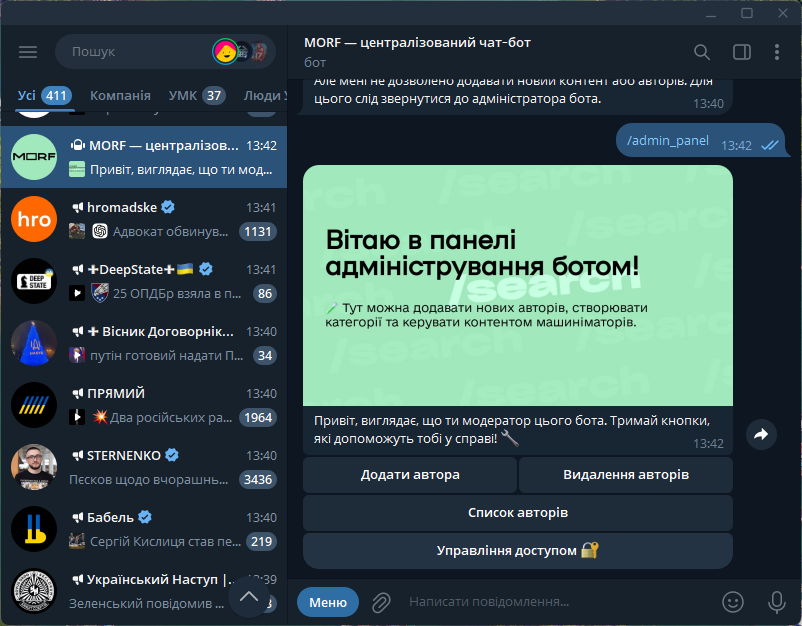

# MachinimaBot

**MachinimaBot** is a Telegram bot written in PHP. It is designed to interact with users on Telegram, providing various functionalities based on the commands it receives.


> *Screenshot of the admin panel showing the management capabilities of the Telegram bot.*

## Features

- Real-time interaction with users on Telegram.
- Easy configuration using environment variables.
- Can work in Webhook mode or in a loop to get updates continuously.
- Various commands for managing machinimators.

## Requirements

- PHP 7.4 or higher
- Composer for dependency management

## Installation

1. Clone the repository:
   ```bash
   git clone https://github.com/ChernegaSergiy/machinima-bot.git
   cd machinima-bot
   ```

3. Install dependencies using Composer:
   ```bash
   composer install
   ```

4. Copy the `.env.example` file to `.env` and set your Telegram bot token:
   ```bash
   cp .env.example .env
   ```
   Edit the `.env` file to include your `BOT_TOKEN`.

## Usage

Run the bot:

```bash
php bot.php
```

If you want the bot to work on Webhook, uncomment the Webhook section in `bot.php`:

```php
// $update = json_decode(file_get_contents("php://input"), true);
// if ($update) {
//     $bot->handleUpdate($update);
// }
```

## System Initialization

The following screenshot shows the initialization process of the MORF Editorial System, which serves as the backbone of MachinimaBot. It verifies the configuration, environment variables, and initializes the bot core before entering the main loop.

## .gitignore

This repository includes a `.gitignore` file to exclude sensitive files like `.env`:

```
# .gitignore
.env
```

## Contributing

Contributions are welcome and appreciated! Here's how you can contribute:

1. Fork the project
2. Create your feature branch (`git checkout -b feature/AmazingFeature`)
3. Commit your changes (`git commit -m 'Add some AmazingFeature'`)
4. Push to the branch (`git push origin feature/AmazingFeature`)
5. Open a Pull Request

Please make sure to update tests as appropriate and adhere to the existing coding style.

## License

This project is licensed under the CSSM Unlimited License v2.0 (CSSM-ULv2). See the [LICENSE](LICENSE) file for details.
